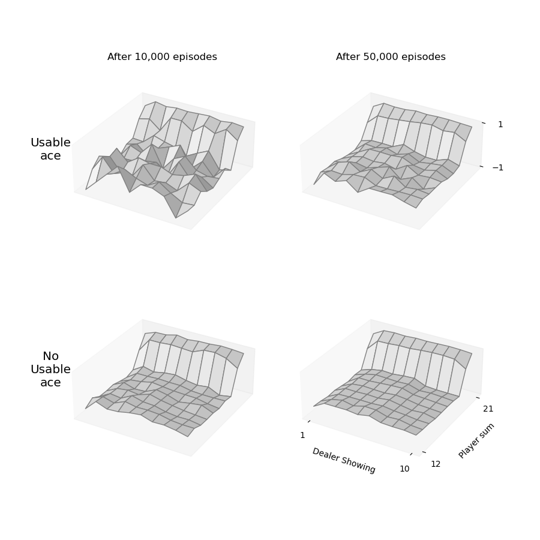

# Reinforcement Learning for Blackjack Game

*Homework 1 of MATH-6450I Reinforcement Learning*

- [x] MC
- [ ] Sarsa
- [ ] Q-learning

Use reinforcement learning algorithms to study the Blackjack game.

## Setting

- One `deck` of `cards` contains $13\times4=52$ cards.
- Objective of the Blackjack game is to obtain cards the sum of whose numerical values is as great as
  possible without exceeding 21.
- All face cards are counted as $10$.
- The card with value $1$ (`Ace`) is called `usable` if the sum of cards at hand (total `points`) plus `10` is smaller or equal to 21, otherwise `not usable`.

- Suppose there are $m$ decks (infinite decks when $m=0$) of cards and $n$ `players`, including $n-1$ `gamblers` and $1$ `dealer`, on the `table`. 

### Game Rules

- Game starts by dealing two cards to each player.
- If someone gets 21 points immediately (check for `Natural` and `Draw`):
  - Only dealer gets 21 points, every gambler loses
  - Dealer and some gambler(s) get 21 points at the same time (Natural), which is a miracle, nobody wins and nobody loses.
  - Some gambler(s) get 21 points (Draw), he/they win(s) and other players lose.

- For each gambler:
  - If total points is smaller than `12`, keep drawing card until exceeds.
  - Based on his observation and his policy, make decision from the two options:
    - `Hit`: draw one card
    - `Stick`: stop drawing card and go to next player
  - If his total points exceed `21` during hitting, we say he goes bust `LOSE_BUST`, and naturally he loses the game.
- Then it's the dealer's turn, his action strictly follows a fixed policy: *sticks on any sum of 17 or greater, and hits otherwise*.
- Finally it goes to the settlement part.

### Game Settlement

- Dealer is excluded from the settlement.
- In practice, for easier comparison, we set the points exceed 21 (busted) to 0.
- If dealer goes bust
  - If there are some gamblers not goes bust, the ones with highest points win(s) and others lose.
  - If everyone goes bust, which is also a miracle, everyone lose!
- If dealer does not goes bust
  - If there are some gamblers not goes bust
    - If the dealer's points is equal to the highest points of gamblers, nobody wins or loses.
    - If the highest points appear in gamblers' hands, the lucky guy(s) win(s) and others lose.
    - If the highest points appear in dealer's hand, all gamblers lose
  - If gamblers all go bust, dealer wins and gamblers lose.

### Reward

- Rewards are given only after all players finishes their turns.

- Wining gamblers get reward $1$, losers get reward $-1$. 
- If nobody wins or loses, everyone gets reward $0$.

## Tasks

### 0. Apply Monte Carlo Prediction on a certain policy

### 1. Find the optimal policy for the Blackjack when $m=\infty$ and $n=2$.

### 2. Visualize the value function and policy

### 3. Repeat 1 and 2 for different combinations of $(m, n)$, e.g. $m=6, 3, 1$, and $n=3, 4, 6$

## Code Logic

### Environment

The object-oriented implementations of the settings described above.

#### Core

- **Enumeration classes**
  - `Action`: Available actions for players. (`HIT`, `STICK`)
  - `GameStatus`: Possible statuses for an episode of Blackjack game. (`END`, `PLAYING`, `NATURAL`, `DRAW`)
  - `PlayerStatus`: Possible statuses for a player in an episode of Blackjack game. (`WIN`, `LOSE`, `LOSE_BUST`, `PLAYING`, `STICK`, `NATURAL`)
  - `UsableAce`: whether an `ace` card is usable. (`NO_USABLE`, `USABLE`)
- **Normal Classes**
  - `Card`
  - `Decks`
  - `PlayerState`
  - `Player`
    - `Gambler`
    - `Dealer`

#### Blackjack

##### `Table`

##### `Blackjack`

### Model

Reinforcement learning models for studying Blackjack game.

#### AbstractModel

- `AbstractModel`: an template abstract class for other models.
  - `q`: returns the values of the action value function for a given state.
  - `predict`: predict action based on state.
  - `train`: train the model.
  - `load` and `save`: load/save the model from/to file.
- `TestModel`: a fixed policy model for testing environment as well as Monte Carlo prediction.
  - sticks on any sum of 20 or greater, and hits otherwise.
  - Its value functions after 10,000 and 50,000 episodes of Monte Carlo learning are shown <a href="#mclearning">here</a>.

#### MonteCarloControl

