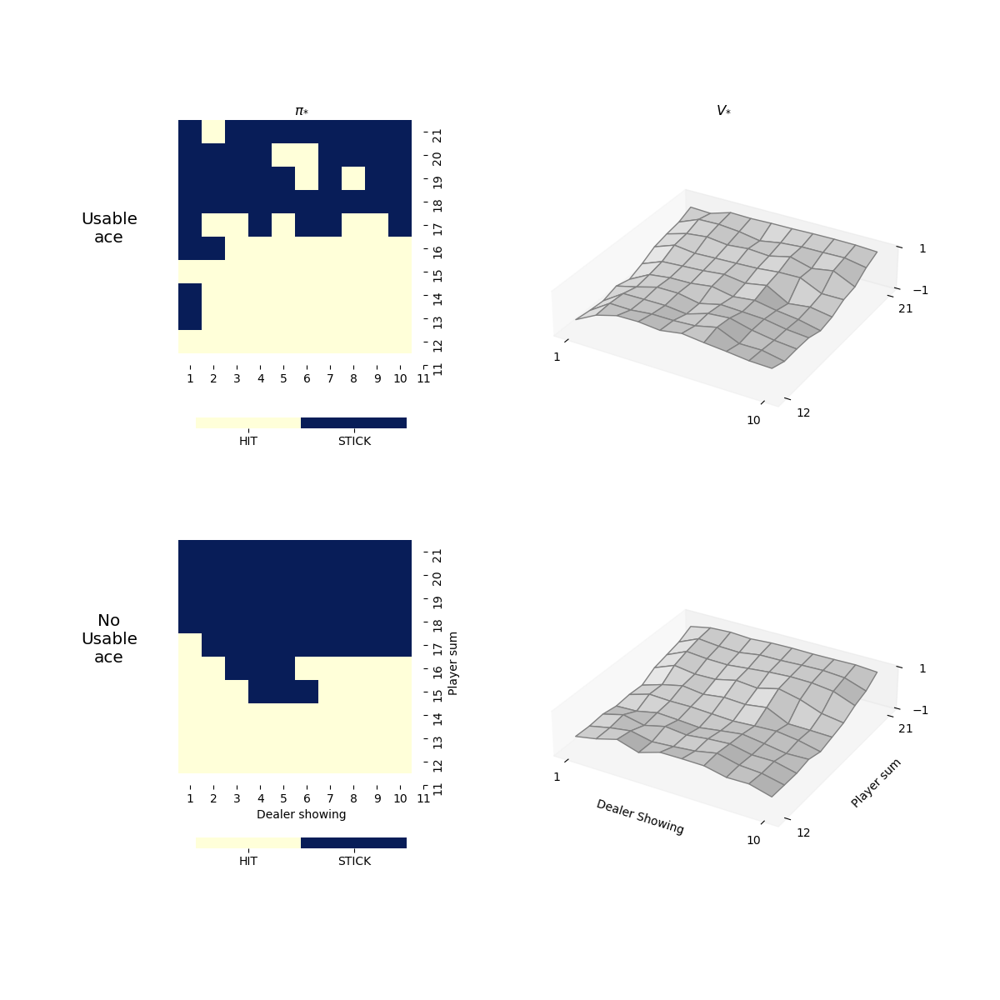

# Reinforcement Learning for Blackjack Game

*Homework 1 of MATH-6450I Reinforcement Learning*

ZHANG Yun

>  Use reinforcement learning methods to study the Blackjack game.

## Table of contents

[TOC]

## Setting

- One `deck` of `cards` contains $13\times4=52$ cards. All face cards are counted as $10$.
- Objective of the Blackjack game is to obtain cards the sum of whose numerical values is as great as
  possible without exceeding 21.
- The card with value $1$ (`Ace`) is called `usable` if the sum of cards at hand (total `points`) plus `10` is smaller or equal to 21, otherwise `not usable`.

- Suppose there are $m$ decks (infinite decks when $m=0$) of cards and $n$ `players`, including $n-1$ `gamblers` and $1$ `dealer`, on the `table`. 

### Game Rules

- Game starts by dealing two cards to each player.
- If someone gets 21 points immediately (check for `Natural` and `Draw`):
  - Only dealer gets 21 points, every gambler loses
  - Dealer and some gambler(s) get 21 points at the same time (Draw), which is a miracle, nobody wins and nobody loses.
  - Some gambler(s) get 21 points (Natural), he/they win(s) and other players lose.

- For each gambler:
  - If total points is smaller than `12`, keep drawing card until exceeds.
  - Based on his observation and his policy, make decision from the two options:
    - `Hit`: draw one card
    - `Stick`: stop drawing card and go to next player
  - If his total points exceed `21` during hitting, we say he goes bust, and he loses the game `LOSE_BUST`.
- Then it's the dealer's turn, his action strictly follows a fixed policy: *sticks on any sum of 17 or greater, and hits otherwise*.
- Finally it goes to the settlement part.

### Game Settlement

- Dealer is excluded from the settlement.
- In practice, for easier comparison, we first set the points exceeding 21 (busted) to 0.
- If dealer goes bust
  - If there are some gamblers not go bust, they win and others lose.
  - If everyone goes bust, which is also a miracle, everyone lose!
- If dealer does not goes bust
  - If there are some gamblers not goes bust
    - Subtract the dealer's point from each gambler's point, those who still have a nonnegative values win, others lose.
  - If gamblers all go bust, dealer wins and gamblers lose.

### Reward

- Rewards are given only after all players finishes their turns.

- Wining gamblers get reward $1$, losers get reward $-1$. 
- If nobody wins or loses, everyone gets reward $0$.
- Reward for Natural is $1.5$.

## Code Architecture

### Environment

The blackjack game with settings described above is implemented in a object-oriented way, the cards, decks, players are all designed objects, which with their various "methods " together consist the game. Brief introductions are provided below.

#### Core

- **Enumeration classes**
  - `Action`: Available actions for players. (`HIT`, `STICK`)
  - `GameStatus`: Possible statuses for an episode of Blackjack game. (`END`, `PLAYING`, `NATURAL`, `DRAW`)
  - `PlayerStatus`: Possible statuses for a player in an episode of Blackjack game. (`WIN`, `LOSE`, `LOSE_BUST`, `PLAYING`, `STICK`, `NATURAL`)
  - `UsableAce`: whether an `ace` card is usable. (`NO_USABLE`, `USABLE`)
- **Normal Classes**
  - `Card`: the poker cards used in Blackjack games. A special `sum` function is implemented considering that all face cards are counted as 10 and possible usable ace.
  - `Decks`: $m$ decks of cards. Card dealing method is implemented here.
  - `PlayerState`: a class for player's states, containing the cards at hand, whether there is a usable ace, and current points.
  - `Player`: a general class for players, containing player's state, and a drawing card method which updates player's state automatically. (`Gambler`, `Dealer`)

#### Blackjack

##### `Table`: decks and players on the casino table

- $m$ `decks` (Decks) and $n$ `players` (List[Player]), the last player is dealer.
- a `deal_all` method, dealing card to all players at the beginning of the blackjack game.
- some quick summaries of players' states and status.

##### `Blackjack`: the blackjack game

- players on the table take actions in sequence, a class attribute `act` stores the id (index) of current player.

| Method    | Description                                                  | Method       | Description                                                  |
| --------- | ------------------------------------------------------------ | ------------ | ------------------------------------------------------------ |
| `step`    | take one step action and return new observation and status.  | `is_over`    | to check if ongoing episode is over.                         |
| `execute` | let current player execute given action                      | `settlement` | game final settlement, assign rewards to gamblers.           |
| `observe` | observation of current player: his sum of points, dealer's showing card, whether he has a usable ace. | `play`       | play one episode of blackjack game, by first dealing card, and then each player taking actions in turn. Return the rewards and players' trajectory. |
| `status`  | update and return present game status.                       |              |                                                              |

### Model

Reinforcement learning models for studying Blackjack game.

#### AbstractModel

- `AbstractModel`: an template abstract class for other models, with some interface methods. 
  - `q`: returns the values of the action value function for a given state.
  - `predict`: predict action based on state.
  - `train`: train the model.
  - `load` and `save`: load/save the model from/to file.
- `TestModel`: a fixed policy model for testing environment as well as performing Monte Carlo prediction.
  - sticks on any sum of 20 or greater, and hits otherwise.
  - Its value functions after 10,000 and 50,000 episodes of Monte Carlo learning are shown <a href="#mclearning">here</a>.

#### Monte Carlo Control, SARSA, Q-Learning

- Since the blackjack game is episodic and reward is given only at the end, the original Sarsa and Q-Learning methods are not appropriate. Here we adopt episodic version of them, the only change is that in one episode, the agent does not take action according to most recently updated policy. The results show that they also work.
- Hyper parameters
  - The $\epsilon$ parameter of the $\epsilon$-greedy method is set to be $\frac{1}{k}$ at the beginning of $k$-th episode.
  - The discount factor $\gamma=1$, and the learning rate $\alpha=0.01$ are constants.
- *Convergence criteria*: we record the last 100 updates of Q function value in a queue with fixed length. If the average of their absolute value is lower than pre specified threshold ($0.001$), the training achieves convergence and stops.

#### Miscellaneous

- The experiments are performed under the `pytest` unit test framework (refer to `learn_optimal_policy.py`), with same hyperparameters.
- The visualization package `Matplotlib` and `seaborn` are used to produce all illustrated figures. The codes for visualization are in `model/model_visualization.py`.

## Tasks

### 0. Apply Monte Carlo Prediction on a fixed policy

Apply Monte Carlo policy evaluation on the extreme policy which sticks on any sum of 20 or greater and hits otherwise. The approximated state value function after 10,000 and 50,000 episodes evaluations are drawn respectively.

It's basically same with Figure 5.1 of Sutton and Barto. The estimates for states with a usable ace are relatively less regular because these states are rare. In any event, after 500,000 games the value function is well approximated.

### 1. Find the optimal policy for the Blackjack when $m=\infty$ and $n=2$.

Now it's time to apply the Monte Carlo Control, Sarsa, and Q-Learning methods to the blackjack game to find the optimal policy. Details of these methods are given <a href="#methods">ealier</a> and the visualizations are in next section. The three methods do not reach the same optimal policy, and the reasons are complicated.

- All of them are not exactly same with (or do not reach) the "real" optimal policy as shown in Figure 5.2 of Sutton and Barto.
  - There might be minor difference between our implementation of the game and the one of Sutton and Barto, including rules, hyperparameters, and potential bugs.
- The convergence criteria is not achieved by the methods, i.e. the training episodes (500,000) are not enough to make the methods converge.

Several failed trails prove that using $\frac{1}{N(s)}$ as learning rate is not a good idea in Monte Carlo Control, since one state usually appears only once in one episode, so that the update is possibly too large. We found that using constant learning rate $\alpha=0.01$ is much better.

The results also indicate that there are always unseen (state, action) pairs in training, e.g. ((21, 5, 1), HIT) where the player gets natural and directly wins. It's believed that's not a serious issue.

### 2. Visualize the value function and policy

From the figures below, we can see that

- The learned policies for the cases with usable ace are unalike and not so regular, because those cases are relatively rare and the algorithms haven't converge for them. Maybe the replay and prioritized replay tricks proposed for DQN could help.
- While for the cases with not usable ace, policies learned by the three methods are roughly the same, except for some boundary points.
- There are alone misfit regions on the policy plot (left part of each figure). By checking the numerical Q-table, we found that the approximated Q-function values for two actions are close at those place. Maybe such problem can be solved by taking more episodes training.

|        Monte Carlo Control        |               SARSA               |            Q-Learning             |
| :-------------------------------: | :-------------------------------: | :-------------------------------: |
|  |  |  |

### 3. Repeat 1 and 2 for different combinations of $(m, n)$, e.g. $m=6, 3, 1$, and $n=3, 4, 6$

Repeat previous experiments with different values of $m$ and $n$ in a similar manner, the rules are unchanged but more sequence of trajectories are used to update Q function in one episode. The number of updates increases but the delay of using freshest Q function is also longer.

In general, these figures suggest that 

- Comparing horizontally, the learned policies for the cases with usable ace are unalike and not much regular as well, same problem with previous simple case. But for the cases with not usable ace, the learned policies by the three methods are roughly the same.
- Comparing vertically, less the decks of cards, larger the the `stick` region.

| $(m, n)$ | Monte Carlo Control | SARSA | Q-Learning |
| -------- | :-----------------: | :---: | :--------: |
| (6, 3)   |  |  |  |
| (6, 4)   |  |  |  |
| (6, 6)   |  |  |  |
| (3, 3)   |  |  |  |
| (3, 4)   |  |  |  |
| (3, 6)   |  |  |  |
| (1, 3)   |  |  |  |
| (1, 4)   |  |  |  |
| (1, 6)   |  |  |  |

Above figures with higher resolution can be found in the path `./record/`, with names `{method}_m{m}_n{n}_e{episodes}.png`.

## Reproducibility of the results

- The Q-function obtained are all saved under the path `./record/npz/` in `numpy.npz` format, and above figures can be directly reproduced with them by using the `draw_policy()` function in `model/model_visualization.py`.
- To reproduce above visualization results as well as the Q-functions, please run the `learn_optimal_policy.py`. It may take hours. Modify the decorator `@pytest.mark.parametrize()` before testing functions to select the settings ($m$ and $n$) and methods ("TD", "MC", "QL").
- The codes and results are also stored on [GitHub](https://github.com/claude9493/Blackjack_RL).

